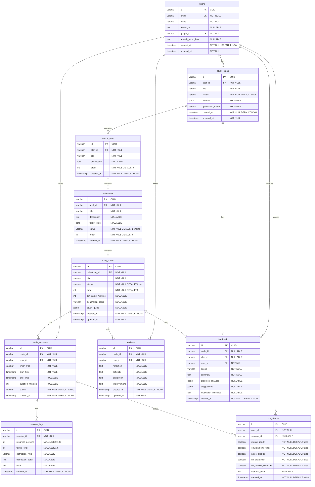

# DB 스키마 — LeadMe

> 버전: 1.0
> 작성일: 2026-04-09
> 기반: spec/04_db_preview.md
> DB: PostgreSQL 16 (Supabase) + Prisma 6

---

## 1. Prisma Schema

```prisma
// schema.prisma

generator client {
  provider = "prisma-client-js"
}

datasource db {
  provider = "postgresql"
  url      = env("DATABASE_URL")
}

// ===========================
// User
// ===========================

model User {
  id                String   @id @default(cuid())
  email             String   @unique @db.VarChar(255)
  name              String   @db.VarChar(100)
  avatarUrl         String?  @map("avatar_url") @db.Text
  googleId          String   @unique @map("google_id") @db.VarChar(255)
  refreshTokenHash  String?  @map("refresh_token_hash") @db.Text

  createdAt DateTime @default(now()) @map("created_at")
  updatedAt DateTime @updatedAt @map("updated_at")

  // Relations
  plans     StudyPlan[]
  sessions  StudySession[]
  reviews   Review[]
  preChecks PreCheck[]
  feedback  Feedback[]

  @@map("users")
}

// ===========================
// Study Plan
// ===========================

model StudyPlan {
  id             String  @id @default(cuid())
  userId         String  @map("user_id") @db.VarChar(30)
  title          String  @db.VarChar(200)
  status         String  @default("draft") @db.VarChar(20)  // draft | active | completed | archived
  params         Json?   @db.JsonB                            // PlanParams (see TypeScript interface below)
  generationMode String? @map("generation_mode") @db.VarChar(20) // basic | detailed

  createdAt DateTime @default(now()) @map("created_at")
  updatedAt DateTime @updatedAt @map("updated_at")

  // Relations
  user      User        @relation(fields: [userId], references: [id], onDelete: Cascade)
  goals     MacroGoal[]
  feedback  Feedback[]

  @@index([userId, status], map: "idx_plans_user_status")
  @@map("study_plans")
}

// ===========================
// Macro Goal
// ===========================

model MacroGoal {
  id          String  @id @default(cuid())
  planId      String  @map("plan_id") @db.VarChar(30)
  title       String  @db.VarChar(200)
  description String? @db.Text
  order       Int     @default(0)

  createdAt DateTime @default(now()) @map("created_at")

  // Relations
  plan       StudyPlan   @relation(fields: [planId], references: [id], onDelete: Cascade)
  milestones Milestone[]

  @@index([planId, order], map: "idx_goals_plan_order")
  @@map("macro_goals")
}

// ===========================
// Milestone
// ===========================

model Milestone {
  id          String  @id @default(cuid())
  goalId      String  @map("goal_id") @db.VarChar(30)
  title       String  @db.VarChar(200)
  description String? @db.Text
  targetDate  DateTime? @map("target_date") @db.Date
  status      String  @default("pending") @db.VarChar(20) // pending | in_progress | completed
  order       Int     @default(0)

  createdAt DateTime @default(now()) @map("created_at")

  // Relations
  goal  MacroGoal  @relation(fields: [goalId], references: [id], onDelete: Cascade)
  nodes TodoNode[]

  @@index([goalId, order], map: "idx_milestones_goal_order")
  @@map("milestones")
}

// ===========================
// Todo Node (Kanban Card)
// ===========================

model TodoNode {
  id               String  @id @default(cuid())
  milestoneId      String  @map("milestone_id") @db.VarChar(30)
  title            String  @db.VarChar(300)
  status           String  @default("todo") @db.VarChar(20)  // todo | in_progress | done
  order            Int     @default(0)
  estimatedMinutes Int?    @map("estimated_minutes")
  generationBasis  String? @map("generation_basis") @db.VarChar(20) // volume_based | structure_based
  studyGuide       Json?   @map("study_guide") @db.JsonB              // StudyGuide (see TypeScript interface)

  createdAt DateTime @default(now()) @map("created_at")
  updatedAt DateTime @updatedAt @map("updated_at")

  // Relations
  milestone Milestone      @relation(fields: [milestoneId], references: [id], onDelete: Cascade)
  sessions  StudySession[]
  reviews   Review[]
  feedback  Feedback[]

  @@index([milestoneId, status], map: "idx_nodes_milestone_status")
  @@index([milestoneId, order], map: "idx_nodes_milestone_order")
  @@map("todo_nodes")
}

// ===========================
// Study Session
// ===========================

model StudySession {
  id              String   @id @default(cuid())
  nodeId          String   @map("node_id") @db.VarChar(30)
  userId          String   @map("user_id") @db.VarChar(30)
  timerType       String   @map("timer_type") @db.VarChar(20) // pomodoro | stopwatch
  startTime       DateTime @map("start_time")
  endTime         DateTime? @map("end_time")
  durationMinutes Int?     @map("duration_minutes")
  status          String   @default("active") @db.VarChar(20) // active | paused | completed

  createdAt DateTime @default(now()) @map("created_at")

  // Relations
  node      TodoNode     @relation(fields: [nodeId], references: [id], onDelete: Cascade)
  user      User         @relation(fields: [userId], references: [id], onDelete: Cascade)
  logs      SessionLog[]
  preChecks PreCheck[]

  @@index([nodeId], map: "idx_sessions_node")
  @@index([userId, startTime], map: "idx_sessions_user_date")
  @@index([nodeId, status], map: "idx_sessions_node_status")
  @@map("study_sessions")
}

// ===========================
// Session Log
// ===========================

model SessionLog {
  id                String  @id @default(cuid())
  sessionId         String  @map("session_id") @db.VarChar(30)
  progressPercent   Int?    @map("progress_percent")   // 0-100
  focusLevel        Int?    @map("focus_level")        // 1-5
  distractionType   String? @map("distraction_type") @db.VarChar(20) // internal | external | none
  distractionDetail String? @map("distraction_detail") @db.Text
  note              String? @db.Text

  createdAt DateTime @default(now()) @map("created_at")

  // Relations
  session StudySession @relation(fields: [sessionId], references: [id], onDelete: Cascade)

  @@index([sessionId], map: "idx_logs_session")
  @@map("session_logs")
}

// ===========================
// Review
// ===========================

model Review {
  id           String  @id @default(cuid())
  nodeId       String  @map("node_id") @db.VarChar(30)
  userId       String  @map("user_id") @db.VarChar(30)
  reflection   String? @db.Text   // 학습 회고
  difficulty   String? @db.Text   // 어려웠던 점
  distraction  String? @db.Text   // 방해 요소
  improvement  String? @db.Text   // 다음 보완점

  createdAt DateTime @default(now()) @map("created_at")
  updatedAt DateTime @updatedAt @map("updated_at")

  // Relations
  node TodoNode @relation(fields: [nodeId], references: [id], onDelete: Cascade)
  user User     @relation(fields: [userId], references: [id], onDelete: Cascade)

  @@index([nodeId], map: "idx_reviews_node")
  @@map("reviews")
}

// ===========================
// Feedback
// ===========================

model Feedback {
  id                 String  @id @default(cuid())
  nodeId             String? @map("node_id") @db.VarChar(30)  // node scope
  planId             String? @map("plan_id") @db.VarChar(30)  // plan scope
  userId             String  @map("user_id") @db.VarChar(30)
  scope              String  @db.VarChar(10)                    // node | plan
  summary            String  @db.Text
  progressAnalysis   Json?   @map("progress_analysis") @db.JsonB // ProgressAnalysis
  suggestions        Json?   @db.JsonB                           // string[]
  motivationMessage  String? @map("motivation_message") @db.Text

  createdAt DateTime @default(now()) @map("created_at")

  // Relations
  node TodoNode?  @relation(fields: [nodeId], references: [id], onDelete: Cascade)
  plan StudyPlan? @relation(fields: [planId], references: [id], onDelete: Cascade)
  user User       @relation(fields: [userId], references: [id], onDelete: Cascade)

  @@index([nodeId], map: "idx_feedback_node")
  @@index([planId], map: "idx_feedback_plan")
  @@index([userId], map: "idx_feedback_user")
  @@map("feedback")
}

// ===========================
// Pre-Check (P1)
// ===========================

model PreCheck {
  id                 String   @id @default(cuid())
  userId             String   @map("user_id") @db.VarChar(30)
  sessionId          String?  @map("session_id") @db.VarChar(30)
  mentalReady        Boolean  @default(false) @map("mental_ready")
  environmentReady   Boolean  @default(false) @map("environment_ready")
  noiseBlocked       Boolean  @default(false) @map("noise_blocked")
  noDistraction      Boolean  @default(false) @map("no_distraction")
  noConflictSchedule Boolean  @default(false) @map("no_conflict_schedule")
  warmupNote         String?  @map("warmup_note") @db.Text

  createdAt DateTime @default(now()) @map("created_at")

  // Relations
  user    User          @relation(fields: [userId], references: [id], onDelete: Cascade)
  session StudySession? @relation(fields: [sessionId], references: [id], onDelete: SetNull)

  @@index([userId, createdAt], map: "idx_prechecks_user_date")
  @@map("pre_checks")
}
```

---

## 2. JSONB 필드 TypeScript 인터페이스

### 2.1 PlanParams (study_plans.params)

```typescript
interface PlanParams {
  studyMaterial: {
    subject: string;
    sources: Array<{
      type: string;                     // "book" | "lecture" | "exam" | "stack" | "web_resource"
      name: string | null;
      totalVolume: string | null;       // "900페이지", "45챕터"
      additionalInfo: string | null;    // "하루 최소 1단원"
    }>;
  } | null;
  finalGoal: string | null;             // "정보처리기사 필기 합격"
  deadline: string | null;              // "2026-06-15" 또는 "3주"
  availableTime: string | null;         // "하루 2시간"
  currentLevel: string | null;          // "입문" | "초급" | "중급" | "고급"
  managementStyle: 'soft' | 'normal' | 'strict' | null;
  contentStructure: string | null;      // 목차/커리큘럼 텍스트
  focusArea: string | null;             // "React hooks가 약함"
  studyMode: string | null;            // "개념 위주" | "문제풀이 위주"
  weeklyGoal: string | null;
  notificationFrequency: string | null;
  motivationFocus: string | null;       // "칭찬형" | "압박형"
}
```

**검증 Zod 스키마 (서버 저장 시)**:
```typescript
const planParamsSchema = z.object({
  studyMaterial: z.object({
    subject: z.string(),
    sources: z.array(z.object({
      type: z.string(),
      name: z.string().nullable(),
      totalVolume: z.string().nullable(),
      additionalInfo: z.string().nullable(),
    })),
  }).nullable(),
  finalGoal: z.string().nullable(),
  deadline: z.string().nullable(),
  availableTime: z.string().nullable(),
  currentLevel: z.string().nullable(),
  managementStyle: z.enum(['soft', 'normal', 'strict']).nullable(),
  contentStructure: z.string().nullable(),
  focusArea: z.string().nullable(),
  studyMode: z.string().nullable(),
  weeklyGoal: z.string().nullable(),
  notificationFrequency: z.string().nullable(),
  motivationFocus: z.string().nullable(),
});
```

### 2.2 StudyGuide (todo_nodes.study_guide)

```typescript
interface StudyGuide {
  objective: string;               // "요구사항 분석 기법 이해"
  prerequisites: string[];         // ["1장 요구사항 확인"]
  generationBasis: 'volume_based' | 'structure_based';
  notes: string | null;           // 추가 학습 메모
}
```

**검증 Zod 스키마**:
```typescript
const studyGuideSchema = z.object({
  objective: z.string().min(1),
  prerequisites: z.array(z.string()),
  generationBasis: z.enum(['volume_based', 'structure_based']),
  notes: z.string().nullable(),
});
```

### 2.3 ProgressAnalysis (feedback.progress_analysis)

```typescript
interface ProgressAnalysis {
  expected: number;    // 예상 진행률 0-100
  actual: number;      // 실제 진행률 0-100
  gap: number;         // actual - expected (음수: 뒤처짐, 양수: 앞서감)
}
```

**검증 Zod 스키마**:
```typescript
const progressAnalysisSchema = z.object({
  expected: z.number().min(0).max(100),
  actual: z.number().min(0).max(100),
  gap: z.number(),
});
```

### 2.4 Suggestions (feedback.suggestions)

```typescript
// string[] — 피드백 제안 목록
// 예: ["내일은 25분 뽀모도로를 4세트로 늘려보세요.", "스마트폰을 다른 방에 두면 집중도가 높아집니다."]
```

**검증 Zod 스키마**:
```typescript
const suggestionsSchema = z.array(z.string().min(1));
```

---

## 3. ERD



---

## 4. 인덱스 전략

| 테이블 | 인덱스명 | 컬럼 | 용도 | 유형 |
|--------|---------|------|------|------|
| users | (PK) | id | 기본 키 | UNIQUE |
| users | (UK) | email | 이메일 조회 | UNIQUE |
| users | (UK) | google_id | OAuth 로그인 조회 | UNIQUE |
| study_plans | idx_plans_user_status | (user_id, status) | 사용자별 활성 계획 조회 | COMPOSITE |
| macro_goals | idx_goals_plan_order | (plan_id, order) | 계획별 Goal 정렬 조회 | COMPOSITE |
| milestones | idx_milestones_goal_order | (goal_id, order) | Goal별 Milestone 정렬 조회 | COMPOSITE |
| todo_nodes | idx_nodes_milestone_status | (milestone_id, status) | 칸반 상태별 조회 | COMPOSITE |
| todo_nodes | idx_nodes_milestone_order | (milestone_id, order) | 칸반 순서 정렬 | COMPOSITE |
| study_sessions | idx_sessions_node | (node_id) | Node별 세션 이력 조회 | SINGLE |
| study_sessions | idx_sessions_user_date | (user_id, start_time) | 사용자 활동 매트릭스 (P2) | COMPOSITE |
| study_sessions | idx_sessions_node_status | (node_id, status) | active 세션 존재 확인 | COMPOSITE |
| session_logs | idx_logs_session | (session_id) | 세션별 로그 조회 | SINGLE |
| reviews | idx_reviews_node | (node_id) | Node별 리뷰 조회 | SINGLE |
| feedback | idx_feedback_node | (node_id) | Node별 피드백 조회 | SINGLE |
| feedback | idx_feedback_plan | (plan_id) | 계획별 피드백 조회 | SINGLE |
| feedback | idx_feedback_user | (user_id) | 사용자별 피드백 조회 | SINGLE |
| pre_checks | idx_prechecks_user_date | (user_id, created_at) | 사용자별 이력 조회 | COMPOSITE |

---

## 5. 관계 및 캐스케이드 삭제 정책

| 부모 | 자식 | onDelete |
|------|------|----------|
| User | StudyPlan | Cascade |
| User | StudySession | Cascade |
| User | Review | Cascade |
| User | Feedback | Cascade |
| User | PreCheck | Cascade |
| StudyPlan | MacroGoal | Cascade |
| StudyPlan | Feedback | Cascade |
| MacroGoal | Milestone | Cascade |
| Milestone | TodoNode | Cascade |
| TodoNode | StudySession | Cascade |
| TodoNode | Review | Cascade |
| TodoNode | Feedback | Cascade |
| StudySession | SessionLog | Cascade |
| StudySession | PreCheck | SetNull (sessionId만 null로) |

**의도**: Plan 삭제 시 하위 전체 계층(Goal → Milestone → Node → Session/Log/Review/Feedback)이 함께 삭제됨. MVP에서 소프트 삭제 미적용 (향후 `deletedAt` 컬럼 추가 가능).

---

## 6. 마이그레이션 전략

### 6.1 초기 마이그레이션

```bash
# backend/ 디렉토리에서 실행
npx prisma migrate dev --name init
```

위 명령으로 `prisma/migrations/` 디렉토리에 마이그레이션 파일 생성.

### 6.2 프로덕션 배포 시

```bash
npx prisma migrate deploy
```

### 6.3 스키마 변경 절차

1. `schema.prisma` 수정
2. `npx prisma migrate dev --name <description>` 실행
3. Prisma Client 자동 재생성 확인
4. 코드에서 새 필드/모델 사용
5. PR에 마이그레이션 파일 포함

---

## 7. 시드 데이터

```typescript
// prisma/seed.ts

import { PrismaClient } from '@prisma/client';

const prisma = new PrismaClient();

async function main() {
  // 1. 테스트 사용자 생성
  const testUser = await prisma.user.upsert({
    where: { email: 'test@gmail.com' },
    update: {},
    create: {
      email: 'test@gmail.com',
      name: '테스트 사용자',
      googleId: 'google_test_12345',
      avatarUrl: null,
    },
  });

  // 2. 샘플 학습 계획 (active 상태)
  const samplePlan = await prisma.studyPlan.create({
    data: {
      userId: testUser.id,
      title: '정보처리기사 필기 합격',
      status: 'active',
      generationMode: 'basic',
      params: {
        studyMaterial: {
          subject: '정보처리기사',
          sources: [{
            type: 'book',
            name: '시나공 정보처리기사',
            totalVolume: '900페이지',
            additionalInfo: '하루 최소 1단원',
          }],
        },
        finalGoal: '정보처리기사 필기 합격',
        deadline: '2026-06-15',
        availableTime: '하루 2시간',
        currentLevel: '입문',
        managementStyle: 'normal',
        contentStructure: null,
        focusArea: null,
        studyMode: null,
        weeklyGoal: null,
        notificationFrequency: null,
        motivationFocus: null,
      },
    },
  });

  // 3. Macro Goal
  const goal = await prisma.macroGoal.create({
    data: {
      planId: samplePlan.id,
      title: '정보처리기사 필기 합격',
      description: '5과목 전체 1회독 + 기출문제 풀이',
      order: 0,
    },
  });

  // 4. Milestone
  const milestone1 = await prisma.milestone.create({
    data: {
      goalId: goal.id,
      title: '1과목 소프트웨어 설계 1회독',
      targetDate: new Date('2026-04-30'),
      status: 'in_progress',
      order: 0,
    },
  });

  const milestone2 = await prisma.milestone.create({
    data: {
      goalId: goal.id,
      title: '2과목 소프트웨어 개발 1회독',
      targetDate: new Date('2026-05-15'),
      status: 'pending',
      order: 1,
    },
  });

  // 5. Todo Nodes
  const node1 = await prisma.todoNode.create({
    data: {
      milestoneId: milestone1.id,
      title: '1장 요구사항 확인 (p.1-45)',
      status: 'done',
      order: 0,
      estimatedMinutes: 120,
      generationBasis: 'volume_based',
      studyGuide: {
        objective: '요구사항 분석 기법 이해',
        prerequisites: [],
        generationBasis: 'volume_based',
        notes: null,
      },
    },
  });

  const node2 = await prisma.todoNode.create({
    data: {
      milestoneId: milestone1.id,
      title: '2장 화면 설계 (p.46-90)',
      status: 'in_progress',
      order: 1,
      estimatedMinutes: 90,
      generationBasis: 'volume_based',
      studyGuide: {
        objective: 'UML, UI 설계 기법 이해',
        prerequisites: ['1장 요구사항 확인'],
        generationBasis: 'volume_based',
        notes: null,
      },
    },
  });

  const node3 = await prisma.todoNode.create({
    data: {
      milestoneId: milestone1.id,
      title: '3장 애플리케이션 설계 (p.91-140)',
      status: 'todo',
      order: 2,
      estimatedMinutes: 120,
      generationBasis: 'volume_based',
      studyGuide: {
        objective: '아키텍처 패턴, 모듈화 이해',
        prerequisites: ['2장 화면 설계'],
        generationBasis: 'volume_based',
        notes: null,
      },
    },
  });

  console.log('Seed data created successfully');
  console.log(`  User: ${testUser.id} (${testUser.email})`);
  console.log(`  Plan: ${samplePlan.id} (${samplePlan.title})`);
  console.log(`  Goal: ${goal.id}`);
  console.log(`  Milestones: ${milestone1.id}, ${milestone2.id}`);
  console.log(`  Nodes: ${node1.id}, ${node2.id}, ${node3.id}`);
}

main()
  .catch((e) => {
    console.error('Seed error:', e);
    process.exit(1);
  })
  .finally(async () => {
    await prisma.$disconnect();
  });
```

**package.json에 seed 명령 추가**:
```json
{
  "prisma": {
    "seed": "ts-node --compiler-options {\"module\":\"CommonJS\"} prisma/seed.ts"
  }
}
```

**실행**:
```bash
npx prisma db seed
```

---

## 8. 설계 결정 기록

| 결정 | 근거 | 대안 | 트레이드오프 |
|------|------|------|------------|
| params를 JSONB로 저장 | 1차/2차 파라미터 구조가 유동적, 필드 추가 시 마이그레이션 불필요 | 별도 테이블 정규화 | JSONB 내부 필드에 인덱스 불가 (현재 필요 없음) |
| study_guide를 JSONB로 저장 | AI 생성 구조가 모델에 따라 변경 가능 | 별도 테이블 | 동일 |
| Feedback에 nodeId, planId 모두 NULLABLE | scope에 따라 하나만 사용 | 별도 테이블 (NodeFeedback, PlanFeedback) | NULL 필드 존재, 하지만 쿼리 단순화 |
| Feedback에 userId FK 추가 | spec/ 원본에 누락 — 사용자별 피드백 조회, 소유권 검증에 필수 | - | - |
| User에 refreshTokenHash 추가 | Refresh Token Rotation + 서버 검증 필요 | 별도 RefreshToken 테이블 | 단일 세션 제한 (MVP 충분), 다중 세션 시 별도 테이블 필요 |
| CUID 사용 | 정렬 가능(시간 순), UUID v4보다 인덱스 효율적, URL-safe | UUID v4, UUID v7 | CUID는 25자로 UUID(36자)보다 짧음 |
| 소프트 삭제 미적용 | MVP 복잡도 최소화 | deleted_at 컬럼 추가 | 데이터 복구 불가, Phase 2에서 필요 시 추가 |
| onDelete: Cascade 전면 적용 | Plan 삭제 시 관련 데이터 일괄 정리 | 소프트 삭제 + 배치 삭제 | 실수로 삭제 시 복구 불가 (MVP 허용) |
| sessions에 node_status 복합 인덱스 추가 | active 세션 존재 확인 쿼리 빈도 높음 (세션 시작 시 매번 체크) | - | 인덱스 공간 소모 |
