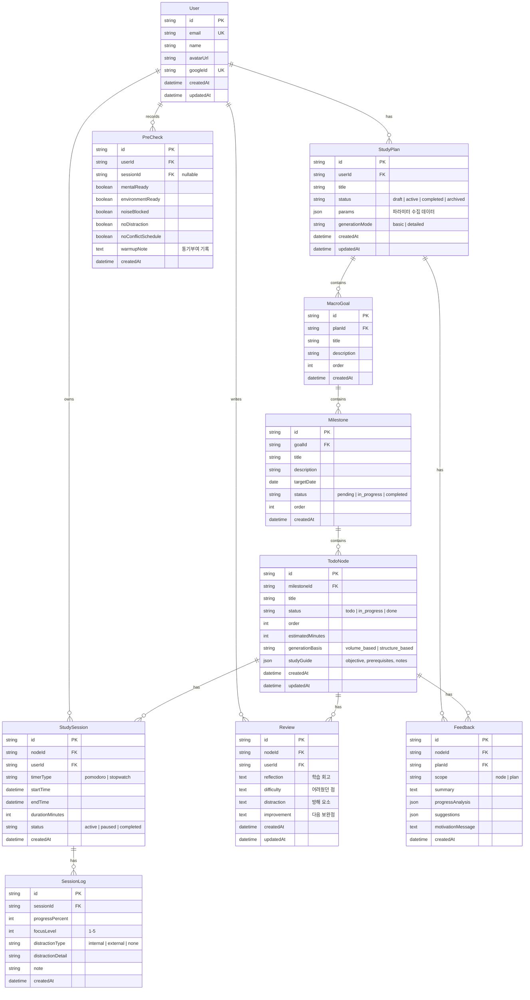

# DB 초안 — LeadMe

> 버전: 0.1 (spec 초안)
> 작성일: 2026-04-09
> DB: PostgreSQL (Supabase) + Prisma ORM

---

## 1. 핵심 엔티티 관계

```
User (1) ──── (N) StudyPlan
StudyPlan (1) ──── (N) MacroGoal
MacroGoal (1) ──── (N) Milestone
Milestone (1) ──── (N) TodoNode
TodoNode (1) ──── (N) StudySession
TodoNode (1) ──── (N) Review
StudySession (1) ──── (N) SessionLog
TodoNode (1) ──── (N) Feedback
User (1) ──── (N) PreCheck
```

---

## 2. ERD



---

## 3. 테이블 정의

### users

| 컬럼 | 타입 | 제약조건 | 설명 |
|------|------|---------|------|
| id | VARCHAR(30) | PK | CUID |
| email | VARCHAR(255) | UNIQUE, NOT NULL | Google 계정 이메일 |
| name | VARCHAR(100) | NOT NULL | 표시 이름 |
| avatar_url | TEXT | NULLABLE | Google 프로필 이미지 URL |
| google_id | VARCHAR(255) | UNIQUE, NOT NULL | Google sub ID |
| created_at | TIMESTAMP | NOT NULL, DEFAULT NOW | 가입일 |
| updated_at | TIMESTAMP | NOT NULL | 수정일 |

### study_plans

| 컬럼 | 타입 | 제약조건 | 설명 |
|------|------|---------|------|
| id | VARCHAR(30) | PK | CUID |
| user_id | VARCHAR(30) | FK → users.id, NOT NULL | 소유자 |
| title | VARCHAR(200) | NOT NULL | 계획 제목 |
| status | VARCHAR(20) | NOT NULL, DEFAULT 'draft' | draft/active/completed/archived |
| params | JSONB | NULLABLE | 수집된 파라미터 전체 (study_material, final_goal, deadline 등) |
| generation_mode | VARCHAR(20) | NULLABLE | basic/detailed |
| created_at | TIMESTAMP | NOT NULL, DEFAULT NOW | |
| updated_at | TIMESTAMP | NOT NULL | |

**params JSONB 구조**:
```json
{
  "studyMaterial": {
    "subject": "정보처리기사",
    "sources": [
      {
        "type": "book",
        "name": "시나공",
        "totalVolume": "900페이지",
        "additionalInfo": "하루 최소 1단원"
      }
    ]
  },
  "finalGoal": "필기 합격",
  "deadline": "2026-06-15",
  "availableTime": "하루 2시간",
  "currentLevel": "입문",
  "managementStyle": "보통",
  "contentStructure": null,
  "focusArea": null,
  "studyMode": null,
  "weeklyGoal": null,
  "notificationFrequency": null,
  "motivationFocus": null
}
```

### macro_goals

| 컬럼 | 타입 | 제약조건 | 설명 |
|------|------|---------|------|
| id | VARCHAR(30) | PK | CUID |
| plan_id | VARCHAR(30) | FK → study_plans.id, NOT NULL | |
| title | VARCHAR(200) | NOT NULL | 최종 목표명 |
| description | TEXT | NULLABLE | 상세 설명 |
| order | INTEGER | NOT NULL, DEFAULT 0 | 정렬 순서 |
| created_at | TIMESTAMP | NOT NULL, DEFAULT NOW | |

### milestones

| 컬럼 | 타입 | 제약조건 | 설명 |
|------|------|---------|------|
| id | VARCHAR(30) | PK | CUID |
| goal_id | VARCHAR(30) | FK → macro_goals.id, NOT NULL | |
| title | VARCHAR(200) | NOT NULL | 중간 목표명 |
| description | TEXT | NULLABLE | |
| target_date | DATE | NULLABLE | 목표 달성일 |
| status | VARCHAR(20) | NOT NULL, DEFAULT 'pending' | pending/in_progress/completed |
| order | INTEGER | NOT NULL, DEFAULT 0 | |
| created_at | TIMESTAMP | NOT NULL, DEFAULT NOW | |

### todo_nodes

| 컬럼 | 타입 | 제약조건 | 설명 |
|------|------|---------|------|
| id | VARCHAR(30) | PK | CUID |
| milestone_id | VARCHAR(30) | FK → milestones.id, NOT NULL | |
| title | VARCHAR(300) | NOT NULL | 할 일 제목 |
| status | VARCHAR(20) | NOT NULL, DEFAULT 'todo' | todo/in_progress/done |
| order | INTEGER | NOT NULL, DEFAULT 0 | 칸반 내 순서 |
| estimated_minutes | INTEGER | NULLABLE | 예상 소요 시간 (분) |
| generation_basis | VARCHAR(20) | NULLABLE | volume_based/structure_based |
| study_guide | JSONB | NULLABLE | {objective, prerequisites, notes} |
| created_at | TIMESTAMP | NOT NULL, DEFAULT NOW | |
| updated_at | TIMESTAMP | NOT NULL | |

### study_sessions

| 컬럼 | 타입 | 제약조건 | 설명 |
|------|------|---------|------|
| id | VARCHAR(30) | PK | CUID |
| node_id | VARCHAR(30) | FK → todo_nodes.id, NOT NULL | |
| user_id | VARCHAR(30) | FK → users.id, NOT NULL | |
| timer_type | VARCHAR(20) | NOT NULL | pomodoro/stopwatch |
| start_time | TIMESTAMP | NOT NULL | |
| end_time | TIMESTAMP | NULLABLE | |
| duration_minutes | INTEGER | NULLABLE | 계산된 총 시간 (분) |
| status | VARCHAR(20) | NOT NULL, DEFAULT 'active' | active/paused/completed |
| created_at | TIMESTAMP | NOT NULL, DEFAULT NOW | |

### session_logs

| 컬럼 | 타입 | 제약조건 | 설명 |
|------|------|---------|------|
| id | VARCHAR(30) | PK | CUID |
| session_id | VARCHAR(30) | FK → study_sessions.id, NOT NULL | |
| progress_percent | INTEGER | NULLABLE | 0-100 |
| focus_level | INTEGER | NULLABLE | 1(최저)-5(최고) |
| distraction_type | VARCHAR(20) | NULLABLE | internal/external/none |
| distraction_detail | TEXT | NULLABLE | |
| note | TEXT | NULLABLE | |
| created_at | TIMESTAMP | NOT NULL, DEFAULT NOW | |

### reviews

| 컬럼 | 타입 | 제약조건 | 설명 |
|------|------|---------|------|
| id | VARCHAR(30) | PK | CUID |
| node_id | VARCHAR(30) | FK → todo_nodes.id, NOT NULL | |
| user_id | VARCHAR(30) | FK → users.id, NOT NULL | |
| reflection | TEXT | NULLABLE | 학습 회고 |
| difficulty | TEXT | NULLABLE | 어려웠던 점 |
| distraction | TEXT | NULLABLE | 방해 요소 |
| improvement | TEXT | NULLABLE | 다음 보완점 |
| created_at | TIMESTAMP | NOT NULL, DEFAULT NOW | |
| updated_at | TIMESTAMP | NOT NULL | |

### feedback

| 컬럼 | 타입 | 제약조건 | 설명 |
|------|------|---------|------|
| id | VARCHAR(30) | PK | CUID |
| node_id | VARCHAR(30) | FK → todo_nodes.id, NULLABLE | node scope일 때 |
| plan_id | VARCHAR(30) | FK → study_plans.id, NULLABLE | plan scope일 때 |
| scope | VARCHAR(10) | NOT NULL | node/plan |
| summary | TEXT | NOT NULL | 요약 |
| progress_analysis | JSONB | NULLABLE | {expected, actual, gap} |
| suggestions | JSONB | NULLABLE | ["suggestion1", ...] |
| motivation_message | TEXT | NULLABLE | |
| created_at | TIMESTAMP | NOT NULL, DEFAULT NOW | |

### pre_checks

| 컬럼 | 타입 | 제약조건 | 설명 |
|------|------|---------|------|
| id | VARCHAR(30) | PK | CUID |
| user_id | VARCHAR(30) | FK → users.id, NOT NULL | |
| session_id | VARCHAR(30) | FK → study_sessions.id, NULLABLE | 연결된 세션 |
| mental_ready | BOOLEAN | NOT NULL, DEFAULT false | |
| environment_ready | BOOLEAN | NOT NULL, DEFAULT false | |
| noise_blocked | BOOLEAN | NOT NULL, DEFAULT false | |
| no_distraction | BOOLEAN | NOT NULL, DEFAULT false | |
| no_conflict_schedule | BOOLEAN | NOT NULL, DEFAULT false | |
| warmup_note | TEXT | NULLABLE | 동기부여/목표 기록 |
| created_at | TIMESTAMP | NOT NULL, DEFAULT NOW | |

---

## 4. 인덱스 전략

| 테이블 | 인덱스명 | 컬럼 | 용도 |
|--------|---------|------|------|
| study_plans | idx_plans_user_status | (user_id, status) | 사용자별 활성 계획 조회 |
| todo_nodes | idx_nodes_milestone_status | (milestone_id, status) | 칸반 보드 상태별 조회 |
| todo_nodes | idx_nodes_milestone_order | (milestone_id, order) | 칸반 정렬 |
| study_sessions | idx_sessions_node | (node_id) | Node별 세션 이력 조회 |
| study_sessions | idx_sessions_user_date | (user_id, start_time) | 사용자 활동 매트릭스 조회 |
| session_logs | idx_logs_session | (session_id) | 세션별 로그 조회 |
| reviews | idx_reviews_node | (node_id) | Node별 리뷰 조회 |
| feedback | idx_feedback_node | (node_id) | Node별 피드백 조회 |
| feedback | idx_feedback_plan | (plan_id) | 계획별 피드백 조회 |
| pre_checks | idx_prechecks_user_date | (user_id, created_at) | 사용자별 이력 조회 |

---

## 5. 설계 결정 메모

| 결정 | 근거 |
|------|------|
| params를 JSONB로 저장 | 파라미터 구조가 1차/2차에 따라 유동적, 별도 테이블 정규화보다 유연 |
| study_guide를 JSONB로 저장 | AI 생성 구조가 모델에 따라 변경될 수 있음, 스키마 고정 불필요 |
| Feedback에 node_id, plan_id 모두 NULLABLE | scope에 따라 하나만 사용 |
| CUID 사용 | 순서 정보 포함, UUID보다 인덱스 효율적 |
| 소프트 삭제 미적용 (MVP) | 복잡도 최소화, 필요 시 deleted_at 컬럼 추가 |
