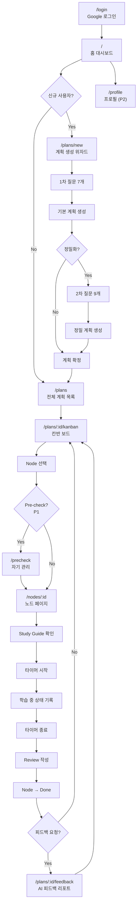
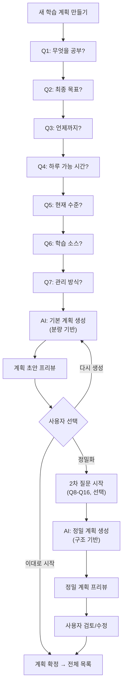
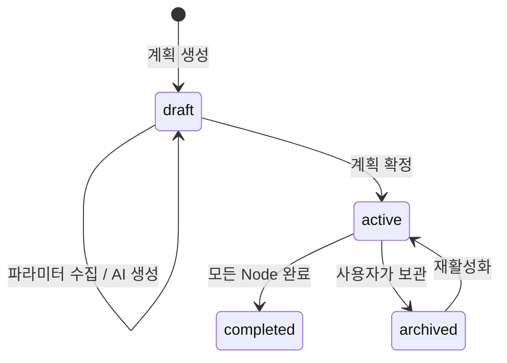
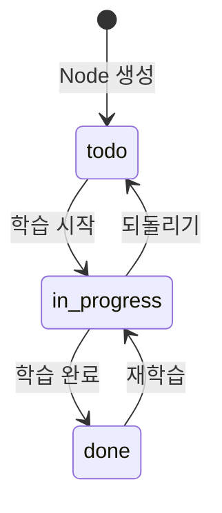
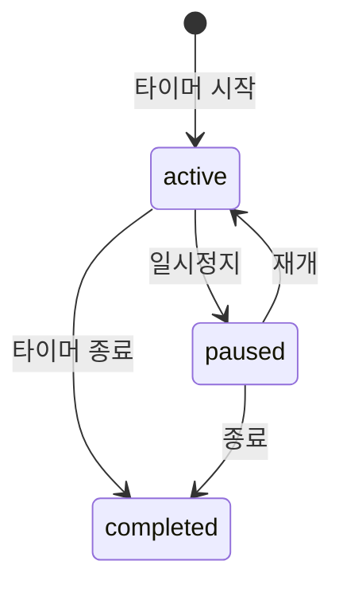

# 화면 설계 — LeadMe

> 버전: 0.1 (spec 초안)
> 작성일: 2026-04-09

---

## 1. 페이지 목록

| # | 경로 | 페이지명 | 설명 | 우선순위 | 주요 컴포넌트 |
|---|------|---------|------|---------|-------------|
| 1 | `/login` | 로그인 | Google 소셜 로그인 | P0 | GoogleLoginButton |
| 2 | `/` | 홈 (대시보드) | 활성 계획 요약, 오늘 할 일, 빠른 진입 | P0 | DashboardSummary, TodayTodos, QuickActions |
| 3 | `/plans` | 전체 계획 목록 | 진행 중/완료/보관된 모든 계획 목록 | P0 | PlanList, PlanCard, FilterTabs |
| 4 | `/plans/new` | 계획 생성 위자드 | AI 질문 기반 계획 생성 | P0 | PlanWizard, QuestionStep, PlanPreview |
| 5 | `/plans/:id` | 계획 상세 | Macro Goal → Milestone → Todo 계층 뷰 + 칸반 | P0 | PlanOverview, KanbanBoard |
| 6 | `/plans/:id/kanban` | 칸반 보드 | Todo/In Progress/Done 칸반 | P0 | KanbanColumn, NodeCard, DragDrop |
| 7 | `/nodes/:id` | 노드 페이지 | Study Guide + Review + Tracker | P0 | StudyGuide, ReviewForm, FocusTimer, StatusRecorder |
| 8 | `/plans/:id/feedback` | 피드백 리포트 | AI 생성 피드백, 진행률 시각화 | P0 | FeedbackCard, ProgressChart |
| 9 | `/precheck` | 자기 관리 | Pre-check 체크리스트 + Warm-up | P1 | PreCheckForm, WarmupTimer |
| 10 | `/profile` | 프로필 | 활동 매트릭스, 누적 시간, 통계 | P2 | ActivityMatrix, StatsChart |

---

## 2. 페이지별 와이어프레임

### 2.1 로그인 (`/login`)

```
┌──────────────────────────────────┐
│           LeadMe                 │
│                                  │
│     공부를 시작하고, 지속하고,      │
│     복기할 수 있도록.              │
│                                  │
│  ┌────────────────────────────┐  │
│  │  🔵 Google로 계속하기       │  │
│  └────────────────────────────┘  │
│                                  │
└──────────────────────────────────┘
```

### 2.2 홈 / 대시보드 (`/`)

```
┌──────────────────────────────────────────────┐
│ [LeadMe]                        [프로필] [로그아웃] │
├──────────────────────────────────────────────┤
│                                              │
│  ┌─────────────────┐  ┌──────────────────┐   │
│  │ 활성 계획        │  │ 오늘 할 일        │   │
│  │                 │  │                  │   │
│  │ 정보처리기사 합격 │  │ □ 1장 요약 읽기   │   │
│  │ 진행률: ████░ 65%│  │ □ 2장 개념 정리   │   │
│  │                 │  │ ✓ 기출 1회차      │   │
│  │ [계획 보기]      │  │                  │   │
│  └─────────────────┘  └──────────────────┘   │
│                                              │
│  ┌──────────────────────────────────────┐    │
│  │  [나의 학습 계획 목록 보기]               │    │
│  └──────────────────────────────────────┘    │
│                                              │
│  ┌──────────────────────────────────────┐    │
│  │ 최근 피드백                           │    │
│  │ "학습 속도가 계획보다 약간 느립니다..."  │    │
│  │ [자세히 보기]                         │    │
│  └──────────────────────────────────────┘    │
└──────────────────────────────────────────────┘
```

### 2.3 전체 계획 목록 (`/plans`)

```
┌──────────────────────────────────────────────┐
│ [LeadMe]                        [프로필] [로그아웃] │
├──────────────────────────────────────────────┤
│                                              │
│  나의 학습 계획                                │
│                                              │
│  [진행 중 (2)]  [완료됨 (5)]  [보관됨 (1)]       │
│  ━━━━━━━━━━━━━━━━━━━━━━━━━━━━━━━━━━━━━━━━━━━━│
│                                              │
│  ┌──────────────────────────────────────┐    │
│  │ 정보처리기사 필기 합격                   │    │
│  │ 진행률: ████████░░ 80%                │    │
│  │ 최근 학습: 2시간 전                    │    │
│  │ [이어서 학습하기 →]                     │    │
│  └──────────────────────────────────────┘    │
│                                              │
│  ┌──────────────────────────────────────┐    │
│  │ 토익 900점 달성                         │    │
│  │ 진행률: ███░░░░░░░ 30%                │    │
│  │ 최근 학습: 2일 전                      │    │
│  │ [이어서 학습하기 →]                     │    │
│  └──────────────────────────────────────┘    │
│                                              │
│  ┌──────────────────────────────────────┐    │
│  │  [+ 새 학습 계획 만들기]               │    │
│  └──────────────────────────────────────┘    │
│                                              │
└──────────────────────────────────────────────┘
```

### 2.4 계획 생성 위자드 (`/plans/new`)

```
┌──────────────────────────────────────────────┐
│ ← 뒤로                                       │
├──────────────────────────────────────────────┤
│                                              │
│  학습 계획 만들기                              │
│  ━━━━━━━━━━━━━━━━━━━━━━━━━━                  │
│  Step 3 of 7                                 │
│                                              │
│  ┌──────────────────────────────────────┐    │
│  │ AI: 언제까지 달성하고 싶으신가요?       │    │
│  │                                      │    │
│  │ 구체적인 날짜나 기간을 알려주세요.       │    │
│  │ (예: 2개월 후, 2026년 6월 15일)        │    │
│  └──────────────────────────────────────┘    │
│                                              │
│  ┌──────────────────────────────────────┐    │
│  │ [2026년 6월 15일                    ] │    │
│  └──────────────────────────────────────┘    │
│                                              │
│          [이전]              [다음 →]         │
│                                              │
│  ─ ─ ─ ─ ─ ─ ─ ─ ─ ─ ─ ─ ─ ─ ─ ─ ─ ─     │
│  이전 답변 요약:                              │
│  · 과목: 정보처리기사                          │
│  · 목표: 필기 합격                            │
│                                              │
└──────────────────────────────────────────────┘
```

**질문 완료 후 → 계획 프리뷰**:

```
┌──────────────────────────────────────────────┐
│ ← 뒤로                                       │
├──────────────────────────────────────────────┤
│                                              │
│  생성된 학습 계획 (초안)          [정밀화하기]  │
│                                              │
│  Macro Goal: 정보처리기사 필기 합격             │
│                                              │
│  ┌─ Milestone 1 ─────────────────────────┐   │
│  │ 1과목 소프트웨어 설계 1회독              │   │
│  │ 목표일: 2026-04-30                     │   │
│  │                                       │   │
│  │  · 1장 요구사항 확인 (2시간)        [편집]│   │
│  │  · 2장 화면 설계 (1.5시간)          [편집]│   │
│  │  · 3장 애플리케이션 설계 (2시간)     [편집]│   │
│  └───────────────────────────────────────┘   │
│                                              │
│  ┌─ Milestone 2 ─────────────────────────┐   │
│  │ 2과목 소프트웨어 개발 1회독              │   │
│  │ ...                                   │   │
│  └───────────────────────────────────────┘   │
│                                              │
│     [다시 생성]        [이 계획으로 시작하기]   │
│                                              │
└──────────────────────────────────────────────┘
```

### 2.5 칸반 보드 (`/plans/:id/kanban`)

```
┌──────────────────────────────────────────────────────────┐
│ ← 정보처리기사 합격                     [피드백] [계획 상세] │
├──────────────────────────────────────────────────────────┤
│                                                          │
│  Milestone: 1과목 소프트웨어 설계 1회독  [▼ Milestone 선택]  │
│                                                          │
│  ┌─── Todo ────┐  ┌─ In Progress ─┐  ┌──── Done ─────┐  │
│  │             │  │               │  │               │  │
│  │ ┌─────────┐ │  │ ┌───────────┐ │  │ ┌───────────┐ │  │
│  │ │3장 앱설계│ │  │ │2장 화면설계│ │  │ │1장 요구사항│ │  │
│  │ │ 2시간    │ │  │ │ 1.5시간   │ │  │ │ 2시간     │ │  │
│  │ │         │ │  │ │ ██░ 40%   │ │  │ │ ████ 100% │ │  │
│  │ └─────────┘ │  │ └───────────┘ │  │ └───────────┘ │  │
│  │             │  │               │  │               │  │
│  │ ┌─────────┐ │  │               │  │               │  │
│  │ │4장 인터  │ │  │               │  │               │  │
│  │ │페이스설계│ │  │               │  │               │  │
│  │ └─────────┘ │  │               │  │               │  │
│  │             │  │               │  │               │  │
│  └─────────────┘  └───────────────┘  └───────────────┘  │
│                                                          │
└──────────────────────────────────────────────────────────┘
```

### 2.6 노드 페이지 (`/nodes/:id`)

```
┌──────────────────────────────────────────────┐
│ ← 칸반으로                                    │
├──────────────────────────────────────────────┤
│                                              │
│  2장 화면 설계                     In Progress │
│  예상: 1.5시간 | Milestone: 1과목 1회독        │
│                                              │
│  ┌─ Study Guide ─────────────────────────┐   │
│  │ 목표: UML, UI 설계 기법 이해            │   │
│  │ 사전 지식: 1장 요구사항 확인             │   │
│  │ 생성 근거: 분량 기반 (p.46-90)          │   │
│  └───────────────────────────────────────┘   │
│                                              │
│  ┌─ Focus Timer ─────────────────────────┐   │
│  │                                       │   │
│  │       ⏱ 18:42                        │   │
│  │    [뽀모도로] [스톱워치]                │   │
│  │                                       │   │
│  │    [시작]  [일시정지]  [종료]           │   │
│  └───────────────────────────────────────┘   │
│                                              │
│  ┌─ 상태 기록 (타임라인) ────────────────┐   │
│  │ 1:00 ✓                                │   │
│  │ 진행도: 20%     │ 방해요소: 없음      │   │
│  │ 집중도: ★★★☆☆ │ 메모: 개념 위주     │   │
│  │ 1:50 ✓                                │   │
│  │   휴식: 10분    │                     │   │
│  │ 2:00 ✓ 🔔 알림                        │   │
│  │ 진행도: [    ]% │ 방해요소: [선택 ▼]  │   │
│  │ 집중도: [선택 ▼]│ 메모: [입력     ]   │   │
│  │                           [기록 저장] │   │
│  │ 2:50 ✓                                │   │
│  │   휴식: [입력]분│                     │   │
│  │ 3:00 ✓                                │   │
│  │                 │                     │   │
│  │ 4:00 □                                │   │
│  └───────────────────────────────────────┘   │
│                                              │
│  ┌─ Review ──────────────────────────────┐   │
│  │ 회고: [                             ] │   │
│  │ 어려웠던 점: [                       ] │   │
│  │ 방해 요소: [                         ] │   │
│  │ 다음 보완점: [                       ] │   │
│  │                          [리뷰 저장]   │   │
│  └───────────────────────────────────────┘   │
│                                              │
│  ┌─ AI 피드백 ───────────────────────────┐   │
│  │ "화면 설계 파트를 잘 진행하셨습니다..."   │   │
│  │ [피드백 새로 받기]                      │   │
│  └───────────────────────────────────────┘   │
│                                              │
└──────────────────────────────────────────────┘
```

### 2.7 자기 관리 (`/precheck`) — P1

```
┌──────────────────────────────────────────────┐
│ ← 홈                                         │
├──────────────────────────────────────────────┤
│                                              │
│  학습 전 점검                                 │
│                                              │
│  ┌─ Pre-check ───────────────────────────┐   │
│  │ ✓ 정신 상태가 학습에 적합한가?           │   │
│  │ ✓ 주변이 정리되어 있는가?               │   │
│  │ □ 소음이 차단되어 있는가?               │   │
│  │ ✓ 방해 요소가 제거되었는가?             │   │
│  │ ✓ 다른 일정이 없는가?                  │   │
│  └───────────────────────────────────────┘   │
│                                              │
│  ┌─ Warm-up (선택) ──────────────────────┐   │
│  │ 오늘의 목표를 적어보세요:               │   │
│  │ [오늘은 2장을 끝내고 3장 시작하기     ] │   │
│  │                                       │   │
│  │ 명상 타이머: [3분] [5분] [10분]        │   │
│  └───────────────────────────────────────┘   │
│                                              │
│           [학습 시작하기 →]                   │
│                                              │
└──────────────────────────────────────────────┘
```

### 2.8 프로필 (`/profile`) — P2

```
┌──────────────────────────────────────────────┐
│ ← 홈                                         │
├──────────────────────────────────────────────┤
│                                              │
│  ┌─────────┐                                │
│  │ 프로필   │  홍길동                        │
│  │  이미지  │  user@gmail.com               │
│  └─────────┘  가입: 2026-04-01              │
│                                              │
│  ┌─ 학습 활동 매트릭스 ──────────────────┐   │
│  │  4월                                  │   │
│  │  월 ░░██░░██░░██░░██░░               │   │
│  │  화 ░░░██░░██░░██░░██░               │   │
│  │  수 ██░░██░░░░██░░██░░               │   │
│  │  목 ░░██░░██░░░░░░██░░               │   │
│  │  금 ██░░██░░██░░██░░██               │   │
│  │  토 ██████░░██░░██░░░░               │   │
│  │  일 ░░░░░░░░░░░░░░░░░░               │   │
│  └───────────────────────────────────────┘   │
│                                              │
│  ┌─ 누적 통계 ───────────────────────────┐   │
│  │ 총 공부 시간: 42시간 30분              │   │
│  │ 완료 Node: 15 / 30                    │   │
│  │ 연속 학습일: 7일                       │   │
│  └───────────────────────────────────────┘   │
│                                              │
└──────────────────────────────────────────────┘
```

---

## 3. 사용자 플로우

### 3.1 전체 사용자 여정



### 3.2 계획 생성 상세 플로우



---

## 4. 핵심 상태 다이어그램

### 4.1 StudyPlan 상태



### 4.2 TodoNode 상태



### 4.3 StudySession 상태

