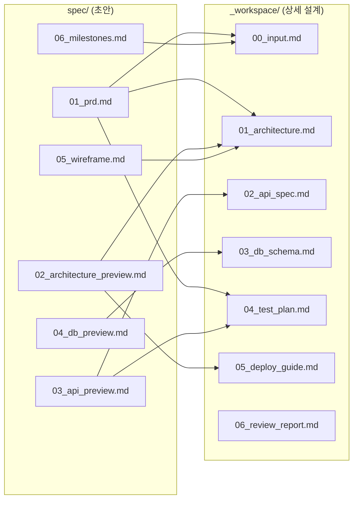

# spec/ Index — LeadMe

> 버전: 0.1
> 작성일: 2026-04-09

---

## 1. 문서 목록

| 파일 | 내용 | 상태 |
|------|------|------|
| `spec/01_prd.md` | 제품 요구사항 정의서 (FR/NFR, 사용자 여정, 제외 범위) | 초안 |
| `spec/02_architecture_preview.md` | 기술 스택, 시스템 구성도, 컴포넌트, 데이터 흐름 | 초안 |
| `spec/03_api_preview.md` | API 엔드포인트, 요청/응답 예시, 에러 코드 | 초안 |
| `spec/04_db_preview.md` | ERD, 테이블 정의, 인덱스 전략 | 초안 |
| `spec/05_wireframe.md` | 페이지 목록, 와이어프레임, 사용자 플로우, 상태 다이어그램 | 초안 |
| `spec/06_milestones.md` | Phase별 마일스톤, 스프린트 계획, 기술 부채 | 초안 |
| `spec/index.md` | 이 파일 (매핑 가이드) | 초안 |

---

## 2. spec/ → _workspace/ 매핑

---

## 3. 에이전트별 활용 프로토콜

| 에이전트 | 주요 참조 문서 | 활용 방식 |
|---------|-------------|----------|
| **architect** | 전체 spec/ | spec/ 검증 → _workspace/ 상세 설계 산출 |
| **frontend-dev** | 01_prd, 02_architecture, 03_api, 05_wireframe | 컴포넌트 구조, 라우팅, API 연동 구현 |
| **backend-dev** | 01_prd, 02_architecture, 03_api, 04_db | API 구현, DB 마이그레이션, AI 서비스 구현 |
| **qa-engineer** | 01_prd, 03_api | 테스트 계획 수립, E2E 시나리오 작성 |
| **devops-engineer** | 02_architecture, 06_milestones | 배포 파이프라인, 환경변수, 인프라 설정 |

---

## 4. 승격 규칙

spec/ 문서는 **초안**이다. `/fullstack-webapp` 호출 시 architect가 아래 절차를 거쳐 _workspace/로 승격한다.

### 승격 절차

1. **spec/ 전체 정독**: 7개 문서를 모두 읽고 일관성 검증
2. **품질 점검**: 완결성, 일관성, 구현 가능성, 빈틈 여부 판정
3. **통과 시**: spec/ 내용을 입력 초안으로 삼아 _workspace/ 상세 설계 작성
4. **미통과 시**: spec/ 재작성 후 사용자에게 재검토 요청

### spec/ vs _workspace/ 차이

| 구분 | spec/ | _workspace/ |
|------|-------|-------------|
| 목적 | 빠른 전체 그림 파악 | 구현팀이 즉시 코딩 시작 |
| 상세도 | 초안 수준 (핵심만) | 구현 수준 (모든 필드, 타입, 검증 규칙) |
| 변경 주체 | 사용자 + architect | architect |
| 변경 시점 | /spec_check, /idea_miner 후 | /fullstack-webapp Phase 2 |

---

## 5. 입력 문서 참조

| 문서 | 역할 |
|------|------|
| `idea.md` | 원본 아이디어 기획서 (상세) |
| `idea_inquiry.md` | 질문 기반 구체화 결과 (LGTM) |

spec/ 문서는 위 두 문서를 기반으로 생성되었다. idea.md의 파라미터 구조(study_material, final_goal 등)와 AI 역할 정의(질문자, 구조화자, 계획 생성기, 피드백 코치)가 API/DB/아키텍처 설계에 반영되어 있다.
